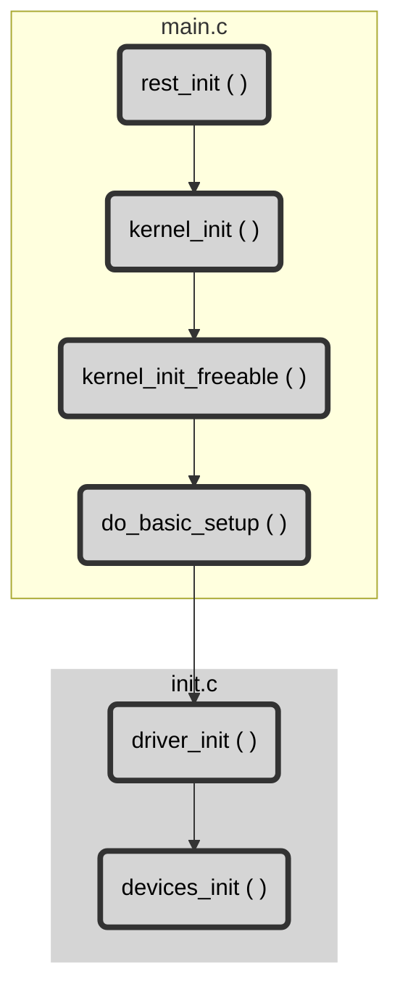

### Device Model has three main components
- Bus: Represents the device which has the multiple devices connected
- Device: A physical or virtual instance representing a device.
- Driver: A software entity which binds to the device and capabale to operate and manage that device/devices

### Device model has three main data structures which represent these three items
- `struct device_driver` -> driver
-` struct bus_type` -> bus
- `struct device` -> device

### Bus Core Drivers
- Kernel has a generic bus driver for each bus which is supported in the kernel.
- A bus connects the processor with the devices.
- Kernel also provides an internal, virtual Platform Bus driver. QUES: What is the importance of platform bus
- Each bus core driver in the kernel implements the `struct bus_type` which is defined in `include/linux/device.h`
- Each bus whether I2C, USB, PCIe is represented by `struct bus_type`.
- Registration of the bus is done by `bus_register()` function.
```c
struct bus_type {
	const char *name;
	const char *dev_name;
	struct device *dev_root;
	struct device_attribute *dev_attrs;
	const struct attribute_group **bus_groups;
	const struct attribute_group **dev_groups;
	const struct attribute_group **drv_groups;
	int (*match)(struct device *dev, struct device_driver *drv);
	int (*uevent)(struct device *dev, struct kobj_uevent_env *env);
	int (*probe)(struct device *dev);
	int (*remove)(struct device *dev);
	void (*shutdown)(struct device *dev);
	int (*online)(struct device *dev);
	int (*offline)(struct device *dev);
	int (*suspend)(struct device *dev, pm_message_t state);
	int (*resume)(struct device *dev);
	const struct dev_pm_ops *pm;
	struct iommu_ops *iommu_ops;
	struct subsys_private *p;
	struct lock_class_key lock_key;
};

struct subsys_private {
	struct kset subsys;
	struct kset *devices_kset;
	struct list_head interfaces;
	struct mutex mutex;

	struct kset *drivers_kset;
	struct klist klist_devices;
	struct klist klist_drivers;
	struct blocking_notifier_head bus_notifier;
	unsigned int drivers_autoprobe:1;
	struct bus_type *bus;

	struct kset glue_dirs;
	struct class *class;
};
```

- The bus initialization function inside the bus core driver will call `device_register()` since bus also act as an device in the kernel and then it calls the `bus_register()`
- `struct bus_type -> struct subsys_private *p  . struct klist klist_devices` is the list of devices in the system which are residing on that bus.
- This list is updated when the device_register() is called when the bus is scanned for the devices by bus controller driver when an device is connected or hotplugged.
- klist_drivers member contains the list of drivers which can serve the devices attached to this bus. This list is updated when the driver_register() is called from the driver initialization.
- New device connects, bus controller driver detects the device and calls the device_register(). When the device is registered with the bus or the host controller the struct device *parent points to the parent device which is a bus device or an host controller device. In case this field in Null then the device is a top-level device which is not expected. 
- The bus_type also maintains the list of the drivers which can handle the devices associated with that bus. When the device is connected the list of drivers is iterated to see if there are any drivers which can handle the new device
	- How this checking happens:
		- "match" function provided in the struct bus_type which matches the compatibility of the driver with the device
		- When the match is found, device is associated with the driver and drivers probe() function is called which is called binding.

Summary:
	- When does the driver attempts to bind the device -
		- When the driver is registered (if the device already exists)
		- When the device is created (if the driver already registered)


#### Initialization
``` 
main.c(rest_init()) 
	-> main.c(kernel_init()) 
		-> main.c(kernel_init_freeable()) 
			-> main.c(do_basic_setup()) 
				-> init.c(driver_init(), this initialize the driver model for the first time)
					- init.c(devices_init(), this populates the "devices" 
					  and "dev" kset dirs in sysfs and inside dev, creates the "block" and "char")
					- init.c(buses_init(), populates the kset dirs - "bus" and "system")
					- init.c(platform_bus_init(), this is the pseudo bus which is meant 
					  for leagecy devices which resides on SoC and thy are directly acessible by the CPU.)

```



