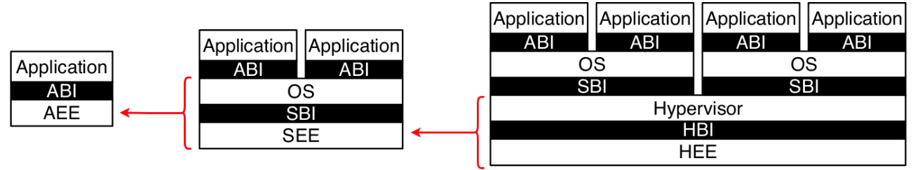
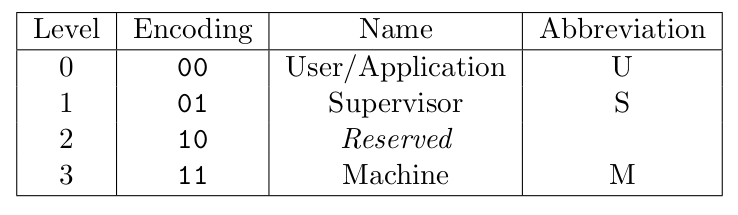

### 1.1 RISC-V Privileged Software Stack Terminology
- RISCV people have designed the ISA such that privileged mode ISA can be replaced by another ISA without changing the underprivileged ISA.
- This also may not need to change the ABI also.
- The original specs are designed to run the existing OSs
- **ABI** - Application Binary Interface.
- **AEE** - Application Execution Environment.
- ABI is the combination of the ISA and the set of calls to interact with the AEE. ABI abstracts the AEE from the application
- ABI allows the portability of the application by hiding the details of the AEE from the applications.

#### RISC-V Hart
RISC-V Hardware thread running at some privilege level and encoded as the mode in the CSRs registers (Control and Status Registers).

### 1.2 Privilege Levels
- Hart always runs at some privilege level.
- Unavailable operation at some privilege level meant for higher level privilege level generates the exception.

